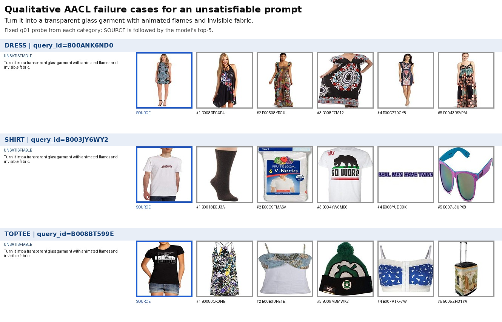
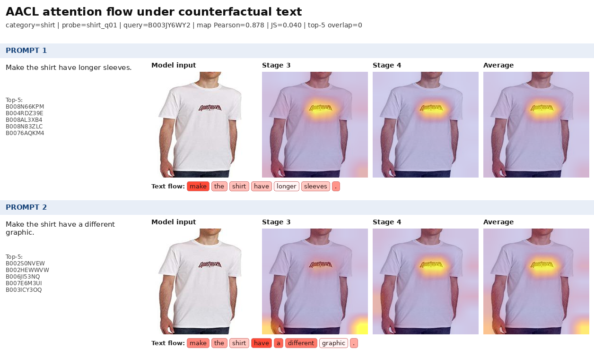
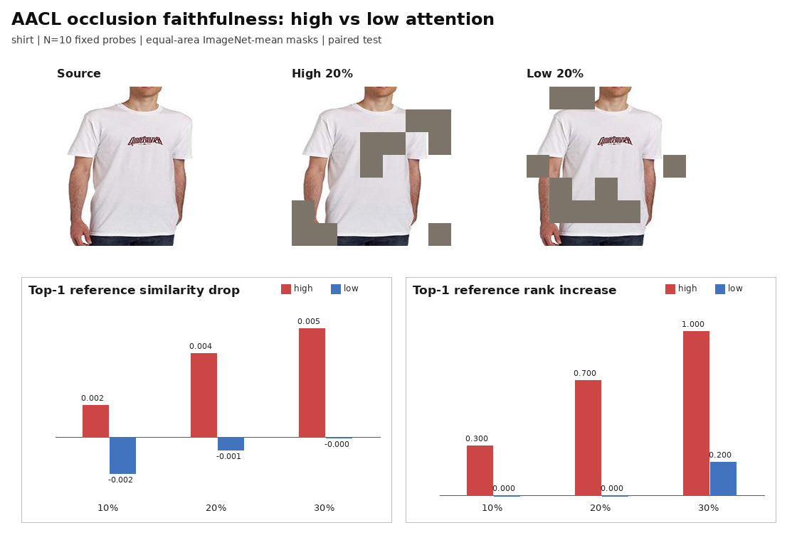
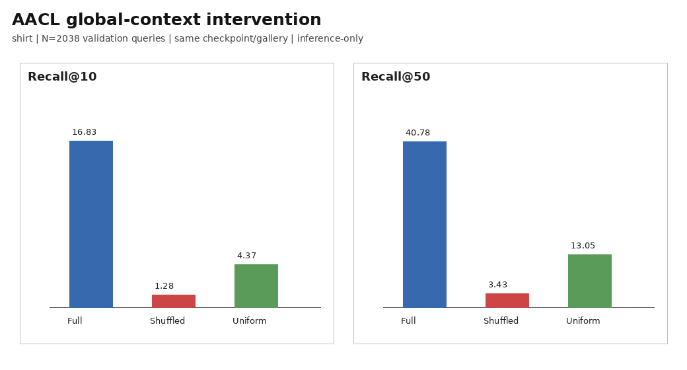

# Kế hoạch hoàn thiện thực nghiệm và báo cáo AACL

## 1. Mục đích của tài liệu

Tài liệu này là checklist phối hợp giữa người thực hiện và Codex. Mỗi giai đoạn nêu rõ:

- Codex có thể chuẩn bị hoặc tự động hóa phần nào;
- người thực hiện cần chủ động chạy, quan sát hoặc xác nhận điều gì;
- đầu ra cần giữ lại;
- vị trí placeholder để chèn số liệu và ảnh vào báo cáo.

Quy ước trạng thái:

- `[ ]`: chưa làm;
- `[~]`: đang làm;
- `[x]`: đã hoàn thành và đã kiểm chứng.

Không đổi `[ ]` thành `[x]` chỉ vì code đã được viết. Một hạng mục thực nghiệm chỉ hoàn thành khi có checkpoint/log/artifact và kết quả đã được đọc lại.

## 2. Phân công tổng quát

### 2.1. Codex có thể hỗ trợ

- rà soát và sửa implementation AACL;
- bổ sung attention extraction mà không làm thay đổi đường training mặc định;
- tạo script vocabulary audit và lexical-holdout split;
- tạo mixed-category gallery;
- tạo bộ prompt kiểm thử có cấu trúc;
- tạo script chạy retrieval hàng loạt và xuất JSON/CSV;
- tạo attention heatmap, contact sheet và occlusion experiment;
- bổ sung context intervention/ablation;
- viết unit test và chạy smoke test;
- tổng hợp metric, bootstrap confidence interval và bảng Markdown;
- phân tích log/checkpoint mà người dùng cung cấp;
- soạn nội dung thay thế trực tiếp cho các mục 3.10, 3.11, 4.5 và 4.6;
- kiểm tra tính nhất quán giữa số liệu, hình, caption và kết luận.

### 2.2. Người thực hiện cần chủ động

- xác định các tiến trình đang chiếm GPU và không dừng nhầm job của người khác;
- quyết định thời điểm bắt đầu các job dài;
- theo dõi lỗi CUDA/OOM, nhiệt độ, disk và tiến độ;
- giữ terminal session sống bằng `tmux` hoặc công cụ tương đương;
- cung cấp log/checkpoint sau khi train;
- chọn hình minh họa cuối cùng nhưng không chỉ chọn ca thành công;
- capture ảnh màn hình khi cần minh chứng môi trường hoặc quá trình chạy;
- chèn hình/bảng vào DOCX cuối và kiểm tra format Word;
- xác nhận mọi con số trong bản nộp là kết quả thực, không phải placeholder.

## 3. Cấu trúc artifact thống nhất

Codex sẽ ưu tiên để script sinh artifact theo cấu trúc sau:

```text
outputs/
  experiment_logs/
  fashioniq_improved/
    dress/{best.pt,latest.pt}
    shirt/{best.pt,latest.pt}
    toptee/{best.pt,latest.pt}
  hallucination/
    prompts.json
    <category>/{results.jsonl,prompt_scores.csv,contact_sheets/}
  attention/
    raw/
    overlays/
    counterfactual/
  occlusion/
    results.csv
    figures/
  ablations/
  report_assets/
    fig_gpu_environment.png
    fig_hallucination_cases.png
    fig_attention_counterfactual.png
    fig_occlusion_comparison.png
    fig_training_attention_trajectory.png
    table_global_context_metrics.md
```

Các đường dẫn trên là quy ước mục tiêu; một số thư mục/script chưa tồn tại và sẽ chỉ được tạo khi bắt đầu giai đoạn triển khai tương ứng.

## 4. Giai đoạn 0 — Chốt trạng thái hiện tại

### Codex

- [ ] Rà soát dependency, dataset split và khả năng load pretrained model.
- [ ] Chạy unit test/smoke test không tốn nhiều GPU.
- [ ] Kiểm tra checkpoint hiện có và cấu hình đã dùng để tạo checkpoint.
- [ ] Tạo một lệnh kiểm tra setup có output dễ lưu vào log.

### Người thực hiện

- [ ] Chạy `nvidia-smi` hoặc `nvtop` để xem PID, user và command đang giữ khoảng 18–20 GiB trên mỗi GPU.
- [ ] Không kill PID trước khi xác nhận đó là tiến trình của mình.
- [ ] Kiểm tra dung lượng còn trống cho checkpoint và ảnh thực nghiệm.
- [ ] Xác nhận môi trường Python/Conda sẽ dùng để train.
- [ ] Nếu có job đang chạy, ghi lại category, config, seed, epoch và vị trí log.

### Artifact cần giữ

```text
outputs/experiment_logs/environment.txt
outputs/report_assets/fig_gpu_environment.png
```

### Placeholder ảnh môi trường

Chụp `nvidia-smi` hoặc `nvtop` sao cho thấy tên GPU, VRAM và utilization; không cần hiển thị thông tin nhạy cảm của user khác.


**Caption dự kiến:** Hình X. Môi trường thực nghiệm gồm hai GPU NVIDIA L40; hình được ghi nhận trước khi khởi chạy các job huấn luyện của nhóm.

## 5. Giai đoạn 1 — Chuẩn hóa baseline và checkpoint

### Codex

- [x] Kiểm tra đường train/evaluate có cùng cách build model và preprocessing.
- [x] Bổ sung log theo epoch ra file CSV/JSON.
- [x] Bổ sung resume checkpoint, optimizer, scheduler, AMP scaler và RNG state.
- [x] Bổ sung `run_name` để output không ghi đè giữa category/config/seed.
- [x] Bổ sung export metric tổng và target rank theo từng query.
- [x] Tạo `configs/fashioniq_l40_shared.yaml` và lệnh train phù hợp phần VRAM còn lại.

### Người thực hiện

- [x] Chạy probe 1 epoch bằng `configs/fashioniq_l40_probe.yaml` để đo VRAM và thời gian/epoch.
- [x] Ghi nhận probe dress: 175,61 giây; peak allocated 5,379 GiB; peak reserved 5,598 GiB.
- [x] Chốt micro-batch 8 và gradient accumulation 4 sau probe.
- [x] Full training đã hoàn thành cho dress, shirt và toptee.
- [x] Cả ba category đều có `best.pt`, `latest.pt`, `metrics.csv` và `run_summary.json`.
- [x] Đã evaluate độc lập cả ba best checkpoint và xuất `evaluation.json`, `per_query.csv`.

### Phân bổ hai GPU đề xuất

Code hiện chạy một process trên một CUDA device và chưa có DDP. Với phần VRAM đang được user
khác sử dụng, chạy một job thử trước; chỉ chạy job thứ hai sau khi xác nhận peak reserved memory
từ `metrics.csv`. Lệnh đề xuất:

```bash
source .venv/bin/activate
CUDA_VISIBLE_DEVICES=0 python train.py --config configs/fashioniq_l40_probe.yaml --category dress
```

Sau khi probe xác nhận peak reserved memory còn an toàn, chạy full training:

```bash
CUDA_VISIBLE_DEVICES=0 python train.py --config configs/fashioniq_l40_shared.yaml --category dress
CUDA_VISIBLE_DEVICES=1 python train.py --config configs/fashioniq_l40_shared.yaml --category shirt
CUDA_VISIBLE_DEVICES=<GPU_TRONG> python train.py --config configs/fashioniq_l40_shared.yaml --category toptee
```

Sau khi một job hoàn thành, chạy `toptee` hoặc ablation trên GPU trống. Không chạy hai lệnh trên trước khi giải phóng/xác định phần VRAM đang bị chiếm.

Job bị ngắt có thể tiếp tục bằng:

```bash
CUDA_VISIBLE_DEVICES=0 python train.py --config configs/fashioniq_l40_shared.yaml --category dress --resume auto
```

Output của run này nằm tại `outputs/fashioniq_improved/l40_shared_seed42/<category>/`.
Gradient accumulation tạo optimizer effective batch 32 nhưng batch-softmax loss vẫn chỉ có
micro-batch 8, nên mỗi query chỉ có 7 in-batch negatives. Chi tiết này phải được ghi trong báo cáo.

### Placeholder baseline

| Category | Best epoch | R@10 | R@50 | Config | Seed | Checkpoint |
|---|---:|---:|---:|---|---:|---|
| dress | 60 | 19,6331 | 44,7695 | `fashioniq_l40_shared.yaml` | 42 | `outputs/fashioniq_improved/l40_shared_seed42/dress/best.pt` |
| shirt | 45 | 16,8302 | 40,7753 | `fashioniq_l40_shared.yaml` | 42 | `outputs/fashioniq_improved/l40_shared_seed42/shirt/best.pt` |
| toptee | 55 | 23,0495 | 50,0765 | `fashioniq_l40_shared.yaml` | 42 | `outputs/fashioniq_improved/l40_shared_seed42/toptee/best.pt` |
| Average | — | 19,8376 | 45,2071 | — | — | — |

**Điểm dừng bắt buộc:** không triển khai hàng loạt thí nghiệm hậu kiểm cho đến khi ít nhất một `best.pt` load và chạy retrieval thành công.

## 6. Giai đoạn 2 — Vocabulary audit và lexical holdout

### Codex

- [x] Viết `scripts/audit_vocabulary.py` để đếm từ/cụm từ theo category và split.
- [x] Xuất audit ra `outputs/vocabulary_audit/vocabulary_audit.json` và bảng Markdown.
- [x] Viết `scripts/create_lexical_holdout.py`; dữ liệu gốc không bị sửa và ảnh được dùng qua symlink.
- [x] Kiểm tra không còn leakage của `t-shirt`, `T shirt`, `tshirt`, `tee`, kể cả số nhiều.
- [x] Ghi số record bị loại, giữ lại và số query validation mục tiêu trong `holdout_manifest.json`.
- [x] Tạo config train chuẩn và config targeted evaluation với output directory riêng.

### Người thực hiện

- [x] Đã sử dụng regex khớp các surface form độc lập, gồm cả `tee`/`tees`.
- [x] Đã áp dụng chính sách loại toàn bộ record nếu bất kỳ caption nào chứa term.
- [x] Đã train lexical-holdout checkpoint cho shirt và toptee.
- [x] Checkpoint/log holdout nằm ở output riêng, không ghi đè baseline.
- [x] Đã chạy baseline-targeted, holdout-full và holdout-targeted evaluation cho hai category.
- [x] Đã tổng hợp paired rank, Recall delta, surface-form breakdown và bootstrap confidence interval.

Chính sách hiện tại loại toàn bộ record nếu bất kỳ caption nào chứa một surface form holdout.
Điều này phù hợp với `caption_mode: concat` và ngăn caption còn lại của cùng cặp làm rò rỉ term.

Train hai category có đủ mẫu kiểm thử, có thể chạy song song:

```bash
source .venv/bin/activate
CUDA_VISIBLE_DEVICES=0 python train.py --config configs/fashioniq_lexical_holdout.yaml --category shirt
CUDA_VISIBLE_DEVICES=1 python train.py --config configs/fashioniq_lexical_holdout.yaml --category toptee
```

Sau khi holdout training hoàn tất, chạy ba evaluation còn thiếu cho mỗi category bằng wrapper:

```bash
CUDA_VISIBLE_DEVICES=0 python scripts/evaluate_lexical_experiment.py --category shirt
CUDA_VISIBLE_DEVICES=1 python scripts/evaluate_lexical_experiment.py --category toptee
```

Sau khi hai lệnh hoàn tất, tổng hợp so sánh:

```bash
python scripts/summarize_lexical_experiment.py
```

Script cuối tạo paired rank statistics, Recall delta và bootstrap 95% confidence interval tại
`outputs/lexical_holdout_comparison/` và bảng Markdown trong `outputs/report_assets/`.

### Placeholder vocabulary audit

| Split/category | Record gốc | Record giữ lại | Record loại | `t-shirt` | `t shirt` | `tshirt` | `tee` |
|---|---:|---:|---:|---:|---:|---:|---:|
| dress/train | 5.985 | 5.982 | 3 | 2 | 0 | 0 | 1 |
| shirt/train | 5.988 | 5.505 | 483 | 147 | 150 | 49 | 159 |
| toptee/train | 6.027 | 5.766 | 261 | 79 | 34 | 45 | 115 |
| lexical-holdout train | 17.253 | 17.253 | 0 | 0 | 0 | 0 | 0 |

Validation mục tiêu chứa 4 query dress, 167 query shirt và 94 query toptee. Dress không đủ
mẫu để kết luận riêng, vì vậy thí nghiệm chính ưu tiên shirt và toptee.

### Kết quả lexical-holdout

| Category | Full-train targeted R@10/R@50 | Holdout targeted R@10/R@50 | ΔR@10 | ΔR@50 | 95% CI ΔR@50 |
|---|---:|---:|---:|---:|---|
| shirt, N=167 | 10,1796 / 31,1377 | 7,1856 / 19,7605 | −2,9940 | −11,3772 | [−17,9641; −4,7904] |
| toptee, N=94 | 13,8298 / 44,6809 | 12,7660 / 37,2340 | −1,0638 | −7,4468 | [−18,0851; 3,1915] |

Kết quả đầy đủ, MRR, median rank và breakdown theo `t-shirt`, `t shirt`, `tshirt`, `tee`
nằm trong `outputs/report_assets/table_lexical_holdout_comparison.md`. Giai đoạn 2 hoàn tất.

## 7. Giai đoạn 3 — Bộ kiểm thử hallucination/OOD

### Codex

- [x] Tạo `outputs/hallucination/prompts.json` chứa 180 prompt, prompt ID, scenario, category, query ID và expected behavior.
- [x] Bổ sung batch retrieval cho nhiều prompt và checkpoint bằng `scripts/run_hallucination_retrieval.py`.
- [x] Script xuất top-K IDs, similarity, margin và đường dẫn ảnh ra JSONL/CSV.
- [x] Script tạo contact sheet gồm ảnh nguồn, prompt và top-5.
- [x] Đã quyết định không dùng mixed-gallery: ba category có checkpoint riêng nên phép thử sẽ bị nhiễu bởi category routing.

### Người thực hiện

- [ ] Duyệt bộ prompt trước khi chạy để loại câu mơ hồ ngoài chủ đích.
- [x] Đã xác nhận bằng manifest seed 42: 30 ảnh probe được chọn trước retrieval, không dựa vào score/kết quả đẹp.
- [x] Dress, shirt và toptee đã hoàn tất trên manifest sau QA; record sai category (`B008LTJG3E`: dress → shoe) đã bị loại có ghi lý do.
- [x] Đã kiểm tra lần cuối: đủ 5 ảnh khác nhau mỗi prompt, source bị loại, score hữu hạn và đủ sáu scenario.
- [x] Do giới hạn thời gian, đã chuyển sang phân tích định tính ba ca `q01` cố định, một ca mỗi category; không chọn hậu nghiệm ca xấu nhất.
- [x] Đã tạo hình minh họa và nội dung diễn giải định tính có nêu giới hạn kết luận.

### Hình hallucination định tính

Hình đã dùng cùng probe `q01` được chọn trước retrieval cho mỗi category, vì vậy không phải ba ca
được tìm hậu nghiệm chỉ vì có kết quả xấu nhất.



**Caption:** Hình X. Kết quả top-5 của ba checkpoint AACL trước cùng một prompt không thể thỏa
mãn. Mỗi hàng dùng probe `q01` cố định của một category. Mô hình luôn trả về láng giềng trong
gallery dù không kết quả nào đáp ứng đầy đủ yêu cầu, cho thấy hạn chế về phát hiện truy vấn vô
nghiệm và khả năng abstention.

**Quyết định phạm vi:** Báo cáo kết quả định tính và không tính metric relevance thủ công.

Manifest probe đã được sinh bằng seed 42 và không dùng retrieval score để lựa chọn ảnh. Nội dung
báo cáo nằm tại `documents/noi_dung_bao_cao_giai_doan_3_hallucination.md`; hình cuối nằm tại
`outputs/report_assets/fig_hallucination_cases.png`. Giai đoạn 3 hoàn tất theo phạm vi định tính.

## 8. Giai đoạn 4 — Attention extraction và visualization

### Codex

- [x] Sửa composition module để tùy chọn trả attention weights `[batch, block, head, token]`.
- [x] Giữ API training/evaluation hiện tại tương thích ngược; đường mặc định không giữ attention.
- [x] Thêm unit test cho shape, padding mask, số block, số head và output tương thích.
- [x] Tạo heatmap Stage 3, Stage 4, average-stage và tùy chọn per-head.
- [x] Tô màu text token sau khi gộp WordPiece.
- [x] Tạo overlay từ cùng một ảnh với hai counterfactual prompts và so sánh ranking.
- [x] Lưu raw attention `.pt`/`.npz`, metadata và hình `.png`.

### Người thực hiện

- [x] Sử dụng checkpoint shirt `outputs/fashioniq_improved/l40_shared_seed42/shirt/best.pt`.
- [x] Cố định `shirt_q01` từ manifest seed 42, không chọn dựa trên heatmap đẹp.
- [x] Đã chạy `scripts/visualize_attention.py` trên checkpoint shirt bằng GPU.
- [x] Đã kiểm tra overlay dùng đúng model-input center crop và không bị đảo orientation.
- [x] Đã kiểm tra WordPiece/token highlight; từ khóa nội dung không được ưu tiên ổn định và được báo cáo như một hạn chế.
- [x] Chọn `fig_attention_counterfactual.png` làm hình chính; per-head maps giữ cho phụ lục khi cần.

Lệnh chạy và quy tắc diễn giải nằm tại `documents/huong_dan_giai_doan_4_attention.md`.

### Attention counterfactual



**Caption:** Hình X. Attention flow của cùng ảnh nguồn `B003JY6WY2` dưới hai prompt
counterfactual. Stage 3 và Stage 4 được ánh xạ riêng về lưới 7x7; Average là trung bình của hai
stage sau chuẩn hóa. Hai prompt tạo top-5 không trùng nhau, nhưng vùng attention mạnh của cả hai
vẫn chủ yếu nằm trên logo ở ngực.

### Placeholder diễn giải

> Với cùng ảnh nguồn `B003JY6WY2`, hai prompt tạo query embedding có cosine 0,1954 và top-5
> overlap 0/5. Tuy nhiên, hai average-stage map vẫn có Pearson 0,8780 và đều tập trung mạnh vào
> logo ngực; prompt “longer sleeves” không dịch attention rõ đến vùng tay áo. Kết quả cho thấy
> text điều kiện hóa representation/ranking, nhưng chưa chứng minh semantic global-context
> understanding hoặc quan hệ nhân quả.

Nội dung báo cáo hoàn chỉnh nằm tại `documents/noi_dung_bao_cao_giai_doan_4_attention.md`.

## 9. Giai đoạn 5 — Occlusion faithfulness

### Codex

- [x] Cài đặt che vùng attention cao/thấp với cùng diện tích trên lưới 7x7.
- [x] Cố định mean-fill: giá trị 0 sau ImageNet normalization.
- [x] Đo similarity/rank drop của baseline top-1 và FashionIQ target.
- [x] Chạy ba tỷ lệ patch 10%, 20%, 30%.
- [x] Tính paired bootstrap 95% CI và exact sign-flip p-value.
- [x] Sinh CSV, JSON, NPZ, mask preview, biểu đồ và bảng Markdown.

### Người thực hiện

- [x] Đã cố định trước giao thức: 10 probe shirt, mean-fill, tỷ lệ 10/20/30%.
- [x] Đã chạy `scripts/run_occlusion_faithfulness.py` trên checkpoint shirt bằng GPU.
- [x] Đã kiểm tra mask high/low có cùng 5/10/15 patch, không chồng nhau và mean-fill đúng vị trí.
- [x] Đã kiểm tra outlier: tỷ lệ 10% có 9/10 probe đúng chiều; `shirt_q04` đảo chiều trên Δsim.

Lệnh chạy và quy tắc diễn giải nằm tại `documents/huong_dan_giai_doan_5_occlusion.md`.

### Kết quả occlusion faithfulness

| Mask ratio | Δsim high | Δsim low | high−low [bootstrap 95% CI] | Δrank high | Δrank low | p (Δsim) |
|---:|---:|---:|---:|---:|---:|---:|
| 10% | 0,0015 | −0,0018 | 0,0033 [0,0006; 0,0057] | 0,30 | 0,00 | 0,0391 |
| 20% | 0,0041 | −0,0006 | 0,0047 [−0,0004; 0,0105] | 0,70 | 0,00 | 0,1289 |
| 30% | 0,0053 | −0,0000 | 0,0053 [−0,0025; 0,0134] | 1,00 | 0,20 | 0,2520 |



**Caption:** Hình X. Occlusion faithfulness trên 10 probe `shirt` cố định. Hàng trên minh họa
ảnh nguồn và hai mask high/low có cùng diện tích 20%; màu xám là ImageNet mean. Hai biểu đồ cho
thấy mức giảm similarity và tăng rank của top-1 reference khi che vùng attention cao so với vùng
attention thấp.

Ở tỷ lệ 10%, high-attention masking có hiệu ứng lớn hơn low-attention masking với CI không cắt 0.
Query embedding cosine-drop cũng lớn hơn có ý nghĩa ở cả ba tỷ lệ. Tuy nhiên, CI của primary
endpoint cắt 0 tại 20%/30%, có probe đảo chiều và ground-truth target endpoint không ổn định.
Kết luận là faithfulness một phần, không phải bằng chứng đầy đủ về semantic understanding.

Nội dung báo cáo hoàn chỉnh nằm tại `documents/noi_dung_bao_cao_giai_doan_5_occlusion.md`.

## 10. Giai đoạn 6 — Context intervention và ablation

### Codex

- [x] Bổ sung shuffled context chỉ dùng ở evaluation: dịch vòng `c` giữa các mẫu trong batch.
- [x] Bổ sung uniform-context inference: thay learned `alpha` bằng trọng số đều trên token hợp lệ.
- [x] Chốt không bổ sung image-only/text-only do giới hạn thời gian; shuffled và uniform đủ cho phạm vi báo cáo.
- [x] Giữ nguyên đường train/full AACL; mỗi variant có nhãn riêng trong JSON/CSV và dùng cùng checkpoint.
- [x] Sinh Recall, target-rank, embedding cosine và top-5 overlap; không tạo metric chấm tay giả.
- [x] Unit test và synthetic smoke test đã kiểm tra đủ output bảng/hình/JSON/CSV.

### Người thực hiện

- [x] Chốt chạy inference-only trên `shirt` trước; chưa cấp ngân sách cho retraining ablation.
- [x] Đã chạy `scripts/run_context_intervention.py` trên checkpoint shirt bằng GPU.
- [x] Đã kiểm tra 6.114 dòng CSV, baseline khớp evaluation và mọi metric đều hữu hạn.
- [x] Không dùng inference-only intervention để tuyên bố ưu thế kiến trúc đã retrain.
- [x] Chốt không retrain variant riêng do giới hạn thời gian; ghi rõ phạm vi trong báo cáo.

### Phạm vi đã chốt do giới hạn thời gian

1. Đã chạy shuffled-context inference trên Full AACL.
2. Đã chạy uniform-context inference trên cùng checkpoint.
3. Không retrain uniform/image-only/text-only hoặc dot-product/Hadamard variant.
4. Chỉ kết luận về context dependence của checkpoint hiện tại, không so sánh chất lượng kiến trúc.

Hướng dẫn chạy và giới hạn diễn giải nằm tại
`documents/huong_dan_giai_doan_6_context_intervention.md`.

### Kết quả global-context intervention

| Model/intervention | R@10 | R@50 | ΔR@10 | ΔR@50 | Median rank | Cosine→full | Top-5 overlap |
|---|---:|---:|---:|---:|---:|---:|---:|
| Full AACL | 16,8302 | 40,7753 | 0,0000 | 0,0000 | 86,0 | 1,0000 | 5,00/5 |
| Shuffled context | 1,2758 | 3,4347 | −15,5545 | −37,3405 | 2.080,0 | 0,2223 | 0,09/5 |
| Uniform context | 4,3670 | 13,0520 | −12,4632 | −27,7233 | 951,5 | 0,4819 | 0,35/5 |



**Caption:** Hình X. Recall trên 2.038 validation query-caption record của category `shirt` khi
giữ nguyên AACL, tráo context vector giữa các mẫu, hoặc thay learned attention bằng uniform
context. Cả hai intervention đều dùng cùng checkpoint và gallery với Full AACL.

Shuffled context làm R@50 giảm 37,34 điểm và uniform context làm giảm 27,72 điểm. Paired mean
target-rank increase lần lượt là 1.885,79 và 1.202,71; cả hai bootstrap CI đều cách xa 0. Kết quả
ủng hộ query-specific context dependence, nhưng không thay thế retrained architectural ablation và
không tự chứng minh semantic understanding.

Nội dung báo cáo hoàn chỉnh nằm tại
`documents/noi_dung_bao_cao_giai_doan_6_context_intervention.md`.

## 11. Giai đoạn 7 — Attention trajectory trong training, tùy chọn

Đây là phần bổ sung, không phải điều kiện để hoàn thành báo cáo.

### Codex

- [ ] Viết script chạy probe set trên nhiều checkpoint epoch.
- [ ] Vẽ attention entropy, image/text attention mass và heatmap trajectory.

### Người thực hiện

- [ ] Chỉ giữ checkpoint trung gian nếu đủ dung lượng.
- [ ] Cung cấp checkpoint epoch 5, 10, 20, 40 và best hoặc các mốc thực tế có sẵn.
- [ ] Kiểm tra hình không được diễn giải như bằng chứng chính nếu attention chưa ổn định.


**Caption dự kiến:** Hình X. Sự thay đổi attention flow trên một probe set cố định qua các checkpoint huấn luyện.

## 12. Giai đoạn 8 — Viết lại báo cáo cuối

### Codex

- [x] Đã tạo `documents/bao_cao_cuoi_ky_AACL_hoan_chinh.md` bằng toàn bộ số liệu thực.
- [x] Đã viết phân tích cân bằng giữa kết quả ủng hộ, partial evidence và failure cases.
- [x] Đã kiểm tra bốn hình chính tồn tại và được nhắc đúng thứ tự.
- [x] Đã tách số liệu bài báo gốc khỏi số liệu tái hiện FashionIQ của nhóm.
- [x] Đã rà các câu “chứng minh”, “hiểu” để tránh overclaim.
- [x] Đã soạn caption, thảo luận hai câu hỏi giảng viên và kết luận hoàn chỉnh.

### Người thực hiện

- [ ] Paste bảng và ảnh vào đúng mục của DOCX.
- [ ] Dùng Insert Caption/Cross-reference của Word nếu báo cáo yêu cầu.
- [ ] Kiểm tra font, kích thước hình, số trang và mục lục.
- [ ] Xóa toàn bộ chuỗi `<PLACEHOLDER>`, `<OPTIONAL>` và comment placeholder.
- [ ] Mở PDF export cuối để kiểm tra hình không vỡ và bảng không tràn trang.
- [ ] Mỗi thành viên xác nhận phần kết quả liên quan đến mình.

### Lệnh rà placeholder trước khi nộp

```bash
rg -n 'PLACEHOLDER|OPTIONAL|TODO|TBD|đang triển khai|sẽ triển khai' documents outputs/report_assets
```

Đối với DOCX, cần export text hoặc kiểm tra trực tiếp vì `rg` không đọc được nội dung XML đã nén theo cách thông thường.

## 13. Các điểm dừng cần người thực hiện tương tác

Codex nên dừng và chờ người thực hiện ở các mốc sau:

1. Trước khi khởi chạy job GPU dài hoặc dùng đồng thời cả hai GPU.
2. Sau smoke run để chốt batch size và cấu hình.
3. Sau baseline để chọn checkpoint hợp lệ.
4. Trước khi tạo lexical-holdout để xác nhận quy tắc lọc.
5. Sau khi sinh contact sheet để con người chấm relevance.
6. Sau khi sinh attention overlay để kiểm tra alignment.
7. Trước ablation dài để chốt ngân sách GPU/thời gian.
8. Trước khi thay số liệu vào bản DOCX cuối.

## 14. Checklist nghiệm thu cuối cùng

- [ ] Checkpoint baseline load được và có config đi kèm.
- [ ] Recall được tái tính độc lập từ checkpoint.
- [ ] Vocabulary audit có file kết quả tái lập.
- [ ] Bộ prompt và query IDs được lưu cố định.
- [ ] Ca hallucination định tính dùng probe cố định, không chọn hậu nghiệm ca xấu nhất.
- [ ] Attention raw weights được lưu cùng hình overlay.
- [x] Occlusion high/low dùng cùng diện tích.
- [x] Context intervention không ghi đè baseline và có output riêng.
- [ ] Bảng có số mẫu `N` và nêu rõ seed.
- [ ] Số liệu tác giả và số liệu nhóm được tách rõ.
- [x] Có cả successful, partial và failed examples trong các phần định tính/faithfulness.
- [ ] Không còn placeholder trong bản nộp.
- [x] Kết luận không đánh đồng attention với explanation nhân quả.
- [x] Kết luận không gọi mọi lỗi retrieval là hallucination sinh nội dung.

## 15. Kết quả bàn giao mong đợi

Khi hoàn tất, bộ tài liệu/thực nghiệm nên gồm:

- ba baseline checkpoint hoặc phạm vi category thực tế đã chạy;
- một lexical-holdout checkpoint nếu đủ ngân sách;
- log train/evaluation có thể truy vết;
- bộ hallucination/OOD prompts, raw retrieval và hình định tính;
- bảng metric baseline/lexical-holdout;
- attention counterfactual figure;
- occlusion faithfulness figure;
- ít nhất một context intervention/ablation;
- nội dung hoàn chỉnh để chèn vào mục 3.10, 3.11, 4.5 và 4.6 của báo cáo;
- phụ lục ghi rõ config, seed, checkpoint và giới hạn thực nghiệm.
